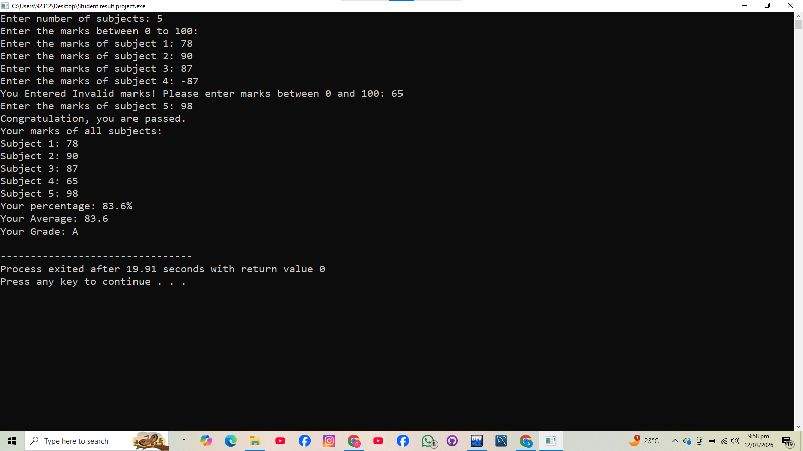

# Student Result System (C++)

A simple C++ program that calculates a student's academic result based on marks entered for multiple subjects.

## Features

- Input marks for any number of subjects
- Validates marks (0 - 100)
- Calculates:
  - Percentage
  - Average
  - Grade
- Displays failed subjects
- Shows final result (Pass / Fail)

## Technologies Used

- C++
- Dev-C++

## Program Functions

showGrade() → Determines grade based on percentage  
showPercentage() → Calculates percentage  
showAvg() → Calculates average marks  
checkResult() → Checks pass or fail status  
showfail() → Displays failed subjects  

## Example Output

Enter number of subjects: 3

Enter marks of subject 1: 80  
Enter marks of subject 2: 75  
Enter marks of subject 3: 90  

Congratulations, you are passed.

Subject 1: 80  
Subject 2: 75  
Subject 3: 90  

Percentage: 81.6%  
Average: 81.6  
Grade: A

## Author

Ayesha  
Software Engineering Student# student-result-system-cpp
A C++ program that calculates student results including percentage, average, grade, and fail subjects.
## Program Output

